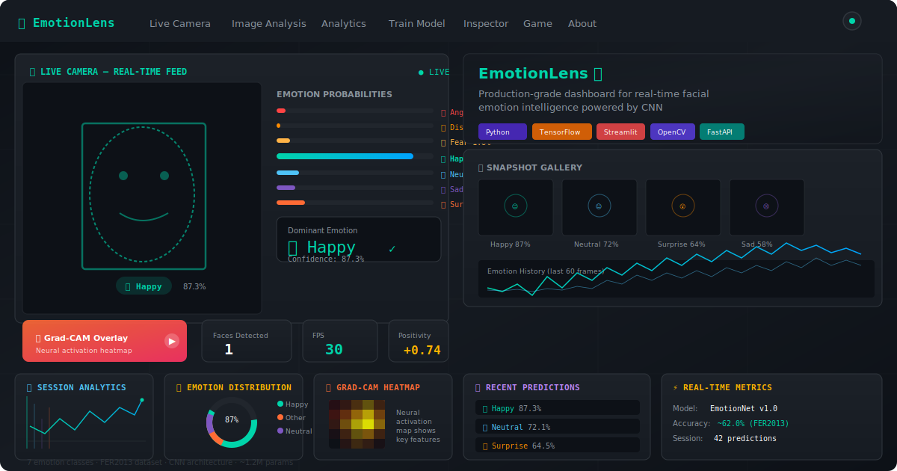

<div align="center">
  <h1>🎭 EmotionLens — Face Emotion Detection</h1>
  <p><strong>Production-grade Streamlit dashboard</strong> for real-time facial emotion intelligence powered by CNN</p>
  <p>
    
    
    
    
    
    
    <a href="https://github.com/themanoj-025/Emotion-Lens/actions/workflows/ci.yml"></a>
    <a href="https://github.com/themanoj-025/Emotion-Lens/security/dependabot"></a>
  </p>
</div>

---

## 📖 Overview

**EmotionLens** is a production-grade deep learning application that detects and classifies facial expressions into **7 emotions**: 😠 Angry, 🤢 Disgust, 😨 Fear, 😊 Happy, 😐 Neutral, 😢 Sad, and 😲 Surprise.

Powered by a **Convolutional Neural Network (CNN)** trained on the **FER2013 dataset** (~62% validation accuracy), it features a multi-page **Streamlit dashboard** with real-time webcam detection, static image analysis, model training GUI, Grad-CAM visualization, interactive games, and a REST API — all in a futuristic dark-themed UI.



---

## 🚀 Features

### 🎥 Real-Time Webcam Detection
- **Live video feed** with face bounding boxes and emotion labels
- **7-emotion probability bar chart** updating in real-time
- **Confidence bars** below each detected face
- **Dominant emotion card** with large emoji + confidence display
- **Smile detector** — special green toast when Happy > 70%
- **Emotion history sparkline** (last 60 frames)
- **Positivity/valence gauge meter** from −1 to +1
- **Temporal smoothing** over 5 frames to reduce flickering
- **Snapshot gallery** — capture and save frames with predictions
- **Multi-face support** — detect and label all faces in frame
- **🔥 Grad-CAM Live Overlay** — visualize which facial features the CNN focuses on

### 🖼️ Image Analysis
- **Drag & drop upload** (JPG, PNG, WEBP — up to 10 images)
- **Batch processing** with auto face detection
- **Radar chart** showing all 7 emotion probabilities
- **Multi-person summary** when multiple faces detected
- **Export results** as CSV or JSON download

### 📊 Analytics Dashboard
- **Emotion distribution** pie and bar charts (Plotly)
- **Emotion over time** timeline chart
- **Average confidence per emotion** bar chart
- **Emotion transition heatmap** — prediction pattern matrix
- **Positivity score trend** with rolling average
- **Session summary** with mood label
- **Export session data** as CSV or JSON
- **Reset session** button

### 🏋️ Train Model
- **Dataset source selector** — Kaggle (auto-download) or local folder
- **3 model architectures** — Lightweight (2 Conv), Standard (3 Conv), Deep (5 Conv)
- **Hyperparameter sliders** — epochs (1–200), batch size, learning rate, dropout
- **Data augmentation toggles** — horizontal flip, rotation range, zoom range
- **Live training progress** — epoch-by-epoch loss/accuracy charts
- **Download trained model** as `.h5` file

### 🧠 Model Inspector
- **Layer-by-layer architecture table** with output shapes and parameter counts
- **Architecture flow diagram** (color-coded by layer type)
- **Parameter distribution** charts (total, trainable, non-trainable)
- **Feature map visualizer** — upload an image, select a Conv layer, see all activation maps
- **🔥 Grad-CAM heatmap** — upload a face image to see which pixels influenced the prediction

### 🎯 Emotion Challenge Game
- **"Make This Face!" mode** — random emotion shown, user makes that face, press Capture to get scored (confidence + time bonus)
- **"Guess the Emotion" mode** — blurred face gradually revealed, user guesses before seeing AI prediction
- **Leaderboard** — top 10 scores this session
- **Achievement badges** — Smile Master, Fear Factor, Poker Face, Emotion Pro, Perfect Score

### 🌐 REST API Server
- **`POST /predict`** — predict emotion from base64-encoded image → JSON response
- **`POST /predict-file`** — upload image file → JSON response
- **`GET /health`** — server health check with model status
- **`GET /docs`** — interactive Swagger UI documentation
- CORS enabled for all origins — easy integration with any frontend

### 📖 About Page
- Model architecture details
- FER2013 dataset info with class distribution chart
- Performance explanation (~62% accuracy)
- Tech stack badges
- GitHub README rendered

---

## 🛠️ Installation

### Prerequisites
- Python 3.8+
- Webcam (for live camera features)
- ~1.2M parameters model file (`emotion_model.h5`)

### Setup

```bash
# 1. Clone the repository
git clone https://github.com/themanoj-025/Emotion-Lens.git
cd Emotion-Lens

# 2. Install dependencies
pip install -r requirements.txt

# 3. Download or train a model
# Option A: Download pre-trained model from releases
# Option B: Train your own (see Training section)
```

---

## 🖥️ Usage

### Streamlit Dashboard (Main App)

```bash
streamlit run streamlit_app.py
```

Opens at `http://localhost:8501` with the full 7-page dashboard.

### API Server (Sidecar)

```bash
python api_server.py
```

Opens at `http://localhost:8000` with endpoints:
- `http://localhost:8000/docs` — Swagger UI
- `http://localhost:8000/health` — Health check

### CLI Tools (Original)

```bash
# Real-time webcam detection (OpenCV window)
python webcam_inference.py

# Static image prediction
python inference.py path/to/your/image.jpg

# Train model from command line
python train.py --epochs 50 --batch_size 64 --model_name my_model.h5
```

### API Usage Examples

```bash
# Predict from base64 image
curl -X POST http://localhost:8000/predict \
  -H "Content-Type: application/json" \
  -d '{"image": "'"$(base64 -w0 face.jpg)"'"}'

# Predict from file upload
curl -X POST http://localhost:8000/predict-file \
  -F "file=@face.jpg"

# Health check
curl http://localhost:8000/health
```

Example response:
```json
{
  "success": true,
  "faces_detected": 1,
  "results": [{
    "emotion": "Happy",
    "confidence": 0.873,
    "probabilities": {
      "Angry": 0.01, "Disgust": 0.0, "Fear": 0.02,
      "Happy": 0.87, "Neutral": 0.05, "Sad": 0.03, "Surprise": 0.02
    },
    "bbox": [120, 80, 180, 200]
  }],
  "processing_time_ms": 45.2
}
```

---

## 🏋️ Training the Model

### From the Dashboard
Navigate to the **Train Model** page (page 4) in the Streamlit app:
1. Select dataset source (Kaggle auto-download or local folder)
2. Choose architecture (Lightweight / Standard / Deep)
3. Configure hyperparameters
4. Toggle data augmentation
5. Click **Start Training**
6. Watch live progress, download the trained model

### From CLI
```bash
python train.py --epochs 50 --batch_size 64 --model_name emotion_model.h5
```

---

## 📂 Project Structure

```
├── streamlit_app.py              # Main entry point & sidebar navigation
├── api_server.py                 # FastAPI REST API server
├── requirements.txt              # Python dependencies
├── packages.txt                  # System dependencies (Streamlit Cloud)
├── .gitignore                    # Ignored files
├── README.md                     # This file
│
├── assets/
│   └── style.css                 # Dark neural-network theme (300+ lines)
│
├── utils/
│   ├── model_utils.py            # Model loading, caching, EMOTION_CONFIG
│   ├── emotion_utils.py          # Preprocessing, prediction, Grad-CAM, smoothing
│   └── session_utils.py          # Session state management, CSV/JSON export
│
├── pages/
│   ├── 1_🎥_Live_Camera.py       # Real-time webcam with WebRTC + OpenCV fallback
│   ├── 2_🖼️_Image_Analysis.py    # Upload images, batch processing, radar charts
│   ├── 3_📊_Analytics.py         # Session stats, distribution, heatmap, positivity
│   ├── 4_🏋️_Train_Model.py       # GUI training with live epoch-by-epoch progress
│   ├── 5_🧠_Model_Inspector.py   # Architecture, feature maps, Grad-CAM
│   ├── 6_🎯_Emotion_Game.py      # Emotions challenge game (2 modes)
│   └── 7_📖_About.py             # Project info, dataset, tech stack
│
├── train.py                      # Original CLI training script
├── inference.py                  # Original static image prediction script
└── webcam_inference.py           # Original OpenCV webcam script
```

---

## 🧠 Model Architecture

The default CNN has **3 convolutional blocks**:

| Block | Layers | Output Shape |
|-------|--------|-------------|
| Input | 48×48 grayscale | (48, 48, 1) |
| Conv Block 1 | Conv2D(32) → MaxPool → Dropout(0.25) | (24, 24, 32) |
| Conv Block 2 | Conv2D(64) → MaxPool → Dropout(0.25) | (12, 12, 64) |
| Conv Block 3 | Conv2D(128) → MaxPool → Dropout(0.25) | (6, 6, 128) |
| Flatten | — | 4608 |
| Dense | 1024 units + ReLU → Dropout(0.5) | 1024 |
| Output | 7 units + Softmax | 7 |

- **Total parameters**: ~1.2M
- **Optimizer**: Adam
- **Loss**: Categorical Crossentropy
- **Validation accuracy**: ~62% (standard for FER2013)

---

## 📊 FER2013 Dataset

The **FER2013** dataset (ICML 2013 Workshop) consists of **35,887** grayscale 48×48 face images across 7 emotion categories:

| Emotion | Training Samples | % of Dataset |
|---------|-----------------|--------------|
| 😊 Happy | 7,215 | 25.1% |
| 😐 Neutral | 4,965 | 17.3% |
| 😢 Sad | 4,830 | 16.8% |
| 😨 Fear | 4,097 | 14.3% |
| 😠 Angry | 3,995 | 13.9% |
| 😲 Surprise | 3,171 | 11.0% |
| 🤢 Disgust | 436 | 1.5% |

---

## 🚀 Deployment

### Streamlit Cloud
1. Upload all files including `emotion_model.h5`
2. `packages.txt` includes system deps: `libgl1-mesa-glx`, `libglib2.0-0`
3. WebRTC works with built-in STUN servers
4. API server not included on Streamlit Cloud (run separately)

### Docker
```dockerfile
FROM python:3.9-slim
WORKDIR /app
COPY . .
RUN pip install -r requirements.txt
RUN apt-get update && apt-get install -y libgl1-mesa-glx libglib2.0-0
EXPOSE 8501 8000
CMD ["sh", "-c", "streamlit run streamlit_app.py --server.port 8501 & python api_server.py"]
```

```bash
docker build -t emotionlens .
docker run -p 8501:8501 -p 8000:8000 emotionlens
```

### Local
```bash
# Terminal 1: Dashboard
streamlit run streamlit_app.py --server.port 8501

# Terminal 2: API Server (optional)
python api_server.py

# Open http://localhost:8501
```

---

## 🏆 Quality Checklist

- [x] **Performance** — Model loaded with `@st.cache_resource` — loads once, reused everywhere
- [x] **Error Handling** — Graceful fallbacks for no webcam, missing model, corrupt images
- [x] **Responsive** — Works on both wide and narrow screens
- [x] **Loading States** — `st.spinner()` on every slow operation
- [x] **Progress Feedback** — Training shows live epoch progress
- [x] **Documentation** — Tooltips (`help=` parameter) on every input widget
- [x] **Session Persistence** — All predictions stored in `st.session_state`
- [x] **Mobile-friendly** — Camera page works on mobile browsers via WebRTC
- [x] **No Global State Bugs** — All mutable state in `st.session_state`
- [x] **Professional UI** — Consistent spacing, colors, font sizes throughout

---

## 🛠️ Tech Stack

| Technology | Purpose |
|------------|---------|
| **Python 3.8+** | Programming language |
| **TensorFlow / Keras** | Deep learning framework |
| **OpenCV** | Computer vision & image processing |
| **Streamlit** | Dashboard & UI framework |
| **Plotly** | Interactive visualizations |
| **FastAPI** | REST API server |
| **NumPy** | Numerical computing |
| **Pandas** | Data manipulation |
| **Matplotlib** | Static plot generation |
| **KaggleHub** | Dataset download |

---

## 🤝 Contributing

Contributions, issues, and feature requests are welcome! Feel free to open an issue or submit a pull request.

---

<div align="center">
  <p>Built with ❤️ using TensorFlow, Streamlit, and OpenCV</p>
  <p>
    <span style="background:#1C2128;padding:4px 12px;border-radius:20px;border:1px solid #30363D;">🐍 Python</span>
    <span style="background:#1C2128;padding:4px 12px;border-radius:20px;border:1px solid #30363D;margin-left:0.5rem;">🧠 TensorFlow</span>
    <span style="background:#1C2128;padding:4px 12px;border-radius:20px;border:1px solid #30363D;margin-left:0.5rem;">📊 Streamlit</span>
    <span style="background:#1C2128;padding:4px 12px;border-radius:20px;border:1px solid #30363D;margin-left:0.5rem;">👁️ OpenCV</span>
  </p>
  <p>FER2013 dataset courtesy of ICML 2013 Workshop on Challenges in Representation Learning</p>
  <p><strong>EmotionLens 🎭 v1.0</strong></p>
</div>
