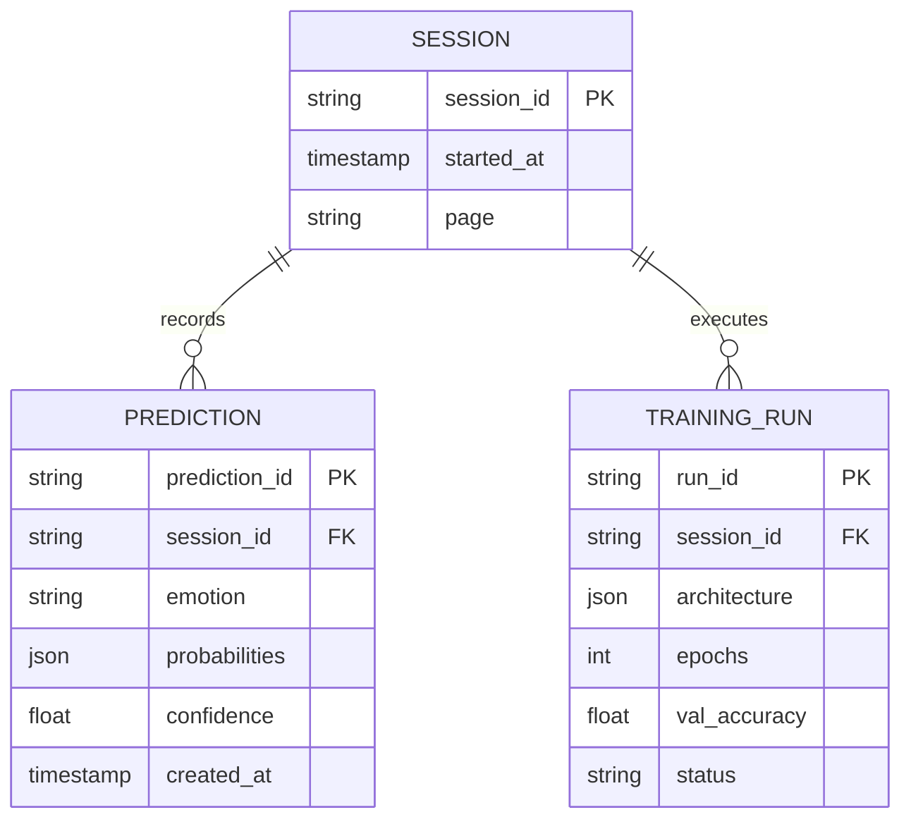

# Schema — EmotionLens: Data Model

| Field | Value |
|---|---|
| Version | v0.1 |
| Last Updated | 2026-08-06 |
| Owner | Data Engineer |
| Status | In Review |

---

> No relational DB in v1. Data is session-state (Streamlit) + model artifacts + optional analytics logs.

## 1. ER Diagram



## 2. Collection Definitions

### TBL-session
| Field | Type | Nullable | Default | Constraints | Description |
|---|---|---|---|---|---|
| session_id | string PK | No | — | unique | Streamlit session |
| started_at | timestamp | No | now() | — | session start |
| page | string | Yes | home | — | current page |

### TBL-prediction
| Field | Type | Nullable | Default | Constraints | Description |
|---|---|---|---|---|---|
| prediction_id | string PK | No | — | unique | pred id |
| session_id | string FK | No | — | → session | parent |
| emotion | string | No | — | 7 classes | top emotion |
| probabilities | json | No | — | 7 floats | class probs |
| confidence | float | No | — | 0..1 | top prob |
| created_at | timestamp | No | now() | — | when |

### TBL-training_run
| Field | Type | Nullable | Default | Constraints | Description |
|---|---|---|---|---|---|
| run_id | string PK | No | — | unique | run id |
| session_id | string FK | No | — | → session | owner |
| architecture | json | No | — | conv blocks etc | config |
| epochs | int | No | — | > 0 | epochs |
| val_accuracy | float | Yes | — | 0..1 | result |
| status | enum | No | running | running/done/failed | state |

## 3. Relationships

- session 1:N predictions (embedded in session state in v1).
- session 1:N training runs.

## 4. Indexes

| Table | Index | Columns | Type | Reason |
|---|---|---|---|---|
| prediction | idx_pred_time | (created_at) | btree | analytics trends |
| prediction | idx_pred_emotion | (emotion) | btree | distribution |

## 5. Enums / Constants

| Enum | Allowed values |
|---|---|
| emotion | angry, disgust, fear, happy, neutral, sad, surprise |
| training_run.status | running, done, failed |
| image size | 48×48 grayscale |

## 6. Data Lifecycle

- Session state cleared on page reload.
- Analytics optional log file; TTL retention (config).

## 7. Migrations

N/A — no DB; schema version in analytics file header.

## 8. Sample Record

```json
{
  "session_id": "sess_1",
  "prediction": { "emotion": "happy", "confidence": 0.87, "probabilities": [0.01, 0.02, 0.03, 0.87, 0.03, 0.02, 0.02] }
}
```

## 9. Data Validation Rules

| Field | Enforced where |
|---|---|
| probabilities | sum ≈ 1 (app) |
| emotion | enum (app) |
| image input | 48×48 grayscale (app) |

## 10. Sensitive Data Map

| Field | Sensitivity | Encrypted at rest? | Masked in logs? |
|---|---|---|---|
| webcam frames (transient) | biometric-ish | no (in-memory) | not persisted |
| uploaded images | personal | no | session-scoped |
| emotion predictions | none | no | no |
| model file | internal | no | — |

## 11. Related Documents

| Document | Relationship |
|---|---|
| [API.md](API.md) | Prediction payloads |
| [TechSpec.md](TechSpec.md) | Components |
| [PRD.md](PRD.md) | Requirements |
| [AppFlow.md](AppFlow.md) | Flows |
| [Design.md](Design.md) | Display data |
| [ImplementationPlan.md](ImplementationPlan.md) | Tasks |
| [Tracker.md](Tracker.md) | Status |
| [Rules.md](Rules.md) | Standards |
| [SecurityAndCompliance.md](SecurityAndCompliance.md) | Biometric data |
| [Testing.md](Testing.md) | Data tests |
| [Deployment.md](Deployment.md) | Deploy |
| [Glossary.md](Glossary.md) | Vocabulary |
| [RiskRegister.md](RiskRegister.md) | Risks |
