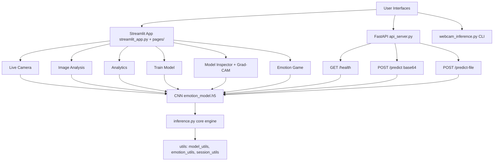
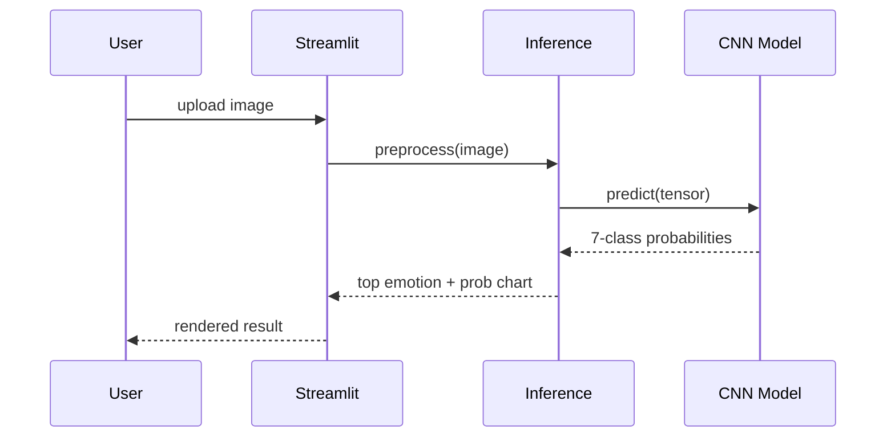
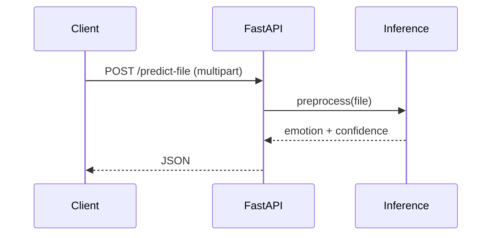

# TechSpec — EmotionLens: Technical Specification

| Field | Value |
|---|---|
| Version | v0.1 |
| Last Updated | 2026-08-06 |
| Owner | Engineering Lead |
| Status | In Review |

---

## 1. Architecture Overview

## 2. Tech Stack Table

| Layer | Technology | Version | Justification |
|---|---|---|---|
| Language | Python | 3.8+ | CV ecosystem |
| Web UI | Streamlit | 1.36+ | Fast interactive dashboards |
| API | FastAPI + uvicorn | 0.104+ | Typed inference endpoints |
| DL | TensorFlow / Keras | 2.x | CNN training + inference |
| CV | OpenCV | 4.x | Haar cascade face detection |
| Viz | Plotly, Matplotlib | — | Charts, Grad-CAM |
| Model | CNN (3 conv blocks 32→64→128) | — | ~1.2M params, 62% acc |
| Deploy | Streamlit Cloud, Docker | — | Hosting |

## 3. System Components

| Component | Responsibility | Inputs → Outputs | Scaling | Failure Modes |
|---|---|---|---|---|
| Streamlit app | Interactive UI | user → widgets | single-user | page crash → session reset |
| Inference engine | Preprocess + predict | image → labels | in-process | model load failure |
| Model loader | Load + cache model | path → model | in-process | missing .h5 |
| Preprocessing | Grayscale, resize, normalize | frame → tensor | in-process | bad image |
| FastAPI | REST inference | request → JSON | per-process | validation 422 |
| Grad-CAM | Saliency map | image → heatmap | in-process | slow on big images |
| Session utils | Streamlit state mgmt | state → UI | per-session | stale state |

## 4. Data Flow Diagrams

## 5. Third-Party Integrations

| Service | Purpose | Failure Fallback | Cost Model | Rate Limits |
|---|---|---|---|---|
| (none in v1) | — | — | — | — |

N/A — fully local/self-contained except optional Streamlit Cloud hosting.

## 6. Non-Functional Requirements

| Category | Requirement | Target | How Verified |
|---|---|---|---|
| Performance | Live FPS | ≥ 15 | webcam benchmark |
| Latency | /predict p95 | < 1s | API logs |
| Accuracy | Validation acc | ~62% | training logs |
| Portability | Runs on CPU | no GPU needed | CI/docs |
| Deployability | Streamlit Cloud + Docker | works | deploy test |

## 7. Environments

| Env | URL | Data | Deploy |
|---|---|---|---|
| dev | localhost:8501/8000 | local model | manual |
| cloud | Streamlit Cloud | bundled model | git push |

## 8. Error Handling Strategy

- Model missing → clear message + train/download instructions.
- Invalid upload → 422 with field error (API).
- Webcam unavailable → UI message, features degrade.
- Grad-CAM failure → return probabilities only.

## 9. Observability

- Streamlit session logs; API access logs.
- Model load timings logged.

## 10. Technical Risks & Mitigations

| Risk | Mitigation |
|---|---|
| Model file large | Documented upload; allow external model path |
| CPU inference slow | Lightweight CNN; cache model |
| Webcam permission | Graceful degradation |
| FER2013 accuracy ceiling | Transparent docs |

## 11. Related Documents

| Document | Relationship |
|---|---|
| [PRD.md](PRD.md) | Requirements |
| [Schema.md](Schema.md) | Data model |
| [API.md](API.md) | Endpoints |
| [AppFlow.md](AppFlow.md) | Flows |
| [Design.md](Design.md) | UI |
| [ImplementationPlan.md](ImplementationPlan.md) | Phases |
| [Tracker.md](Tracker.md) | Status |
| [Rules.md](Rules.md) | Standards |
| [SecurityAndCompliance.md](SecurityAndCompliance.md) | Privacy |
| [Testing.md](Testing.md) | Tests |
| [Deployment.md](Deployment.md) | Environments |
| [Glossary.md](Glossary.md) | Vocabulary |
| [RiskRegister.md](RiskRegister.md) | Risks |
