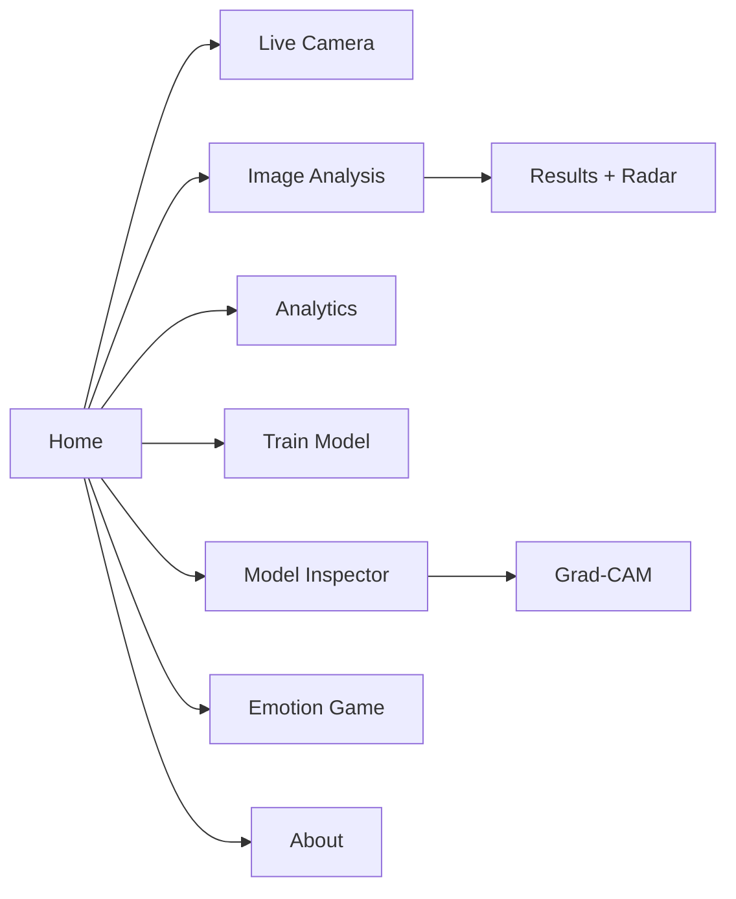
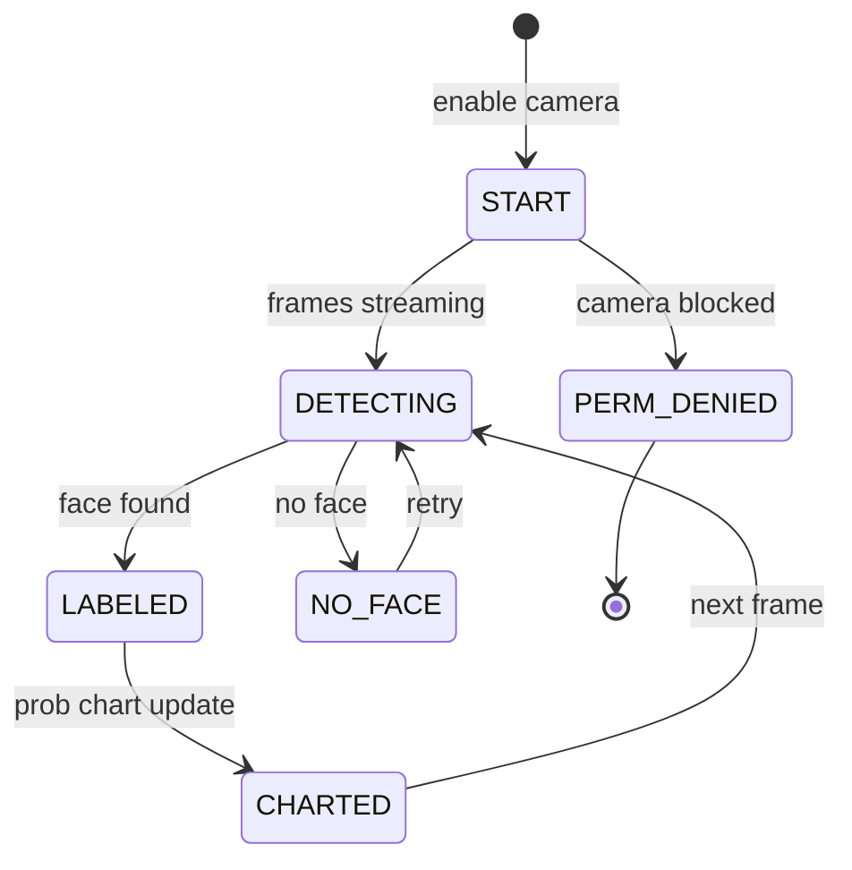
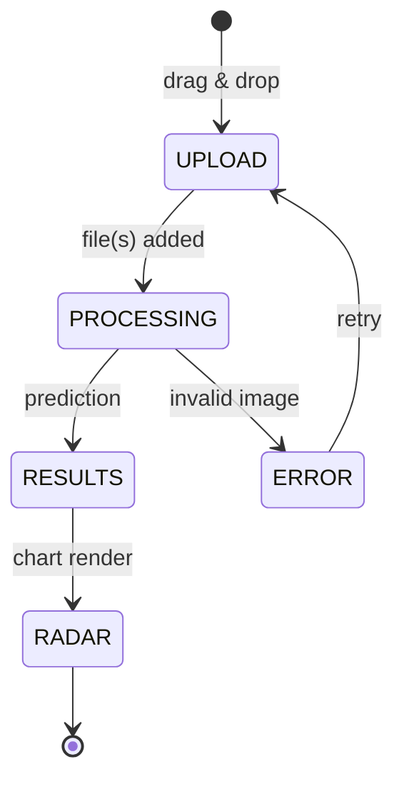

# AppFlow — EmotionLens: Application Flow

|Field|Value|
|---|---|
|Version|v0.1|
|Last Updated|2026-08-06|
|Owner|PM / QA|
|Status|In Review|

---

## 1. Screen Inventory

|SCR-###|Screen|Purpose|Entry|Exit|Auth|
|---|---|---|---|---|---|
|SCR-001|Home|Navigation + overview|app start|all pages|No|
|SCR-002|Live Camera|Real-time detection|nav|stop cam|No|
|SCR-003|Image Analysis|Upload + batch + radar|nav|detail|No|
|SCR-004|Analytics|Distribution/trends/heatmaps|nav|—|No|
|SCR-005|Train Model|Configurable training|nav|run|No|
|SCR-006|Model Inspector|Layers, feature maps, Grad-CAM|nav|—|No|
|SCR-007|Emotion Game|Gamified challenge|nav|play|No|
|SCR-008|About|Project info|nav|—|No|

## 2. Navigation Map

## 3. Detailed Flow per Journey

### Live detection

### Image analysis

## 4. Empty / Loading / Error States

|Screen|Empty|Loading|Error|
|---|---|---|---|
|Live Camera|"Enable camera" prompt|starting|permission message|
|Image Analysis|"Upload an image"|processing spinner|invalid file error|
|Analytics|"No session data"|—|—|
|Train Model|defaults shown|progress bar|training error|
|Game|"Start game"|—|—|

## 5. Edge Cases & Branching Logic

|IF condition|THEN route|
|---|---|
|No model file|Show setup instructions|
|Webcam denied|UI message, image mode still works|
|Multiple faces|Detect + label each face|
|Grad-CAM heavy image|Downscale or skip heatmap|
|Invalid upload|422 / UI error|

## 6. Notifications & Re-engagement

|Trigger|Channel|Destination|
|---|---|---|
|Training complete|UI success|user|
|Game badge earned|UI badge|user|

## 7. Cross-Platform Deltas

- Web (Streamlit) full-featured; local webcam script CLI-only.

## 8. Related Documents

|Document|Relationship|
|---|---|
|[PRD.md](../product/PRD.md)|US-001…007|
|[TechSpec.md](../technical/TechSpec.md)|Components|
|[Design.md](Design.md)|Screens|
|[Schema.md](../technical/Schema.md)|Session data|
|[ImplementationPlan.md](../project/ImplementationPlan.md)|Tasks|
|[Tracker.md](../project/Tracker.md)|Status|
|[Rules.md](../project/Rules.md)|Standards|
|[API.md](../technical/API.md)|Endpoints|
|[SecurityAndCompliance.md](../technical/SecurityAndCompliance.md)|Privacy|
|[Testing.md](../technical/Testing.md)|Tests|
|[Deployment.md](../technical/Deployment.md)|Env|
|[Glossary.md](../reference/Glossary.md)|Vocabulary|
|[RiskRegister.md](../project/RiskRegister.md)|Risks|
