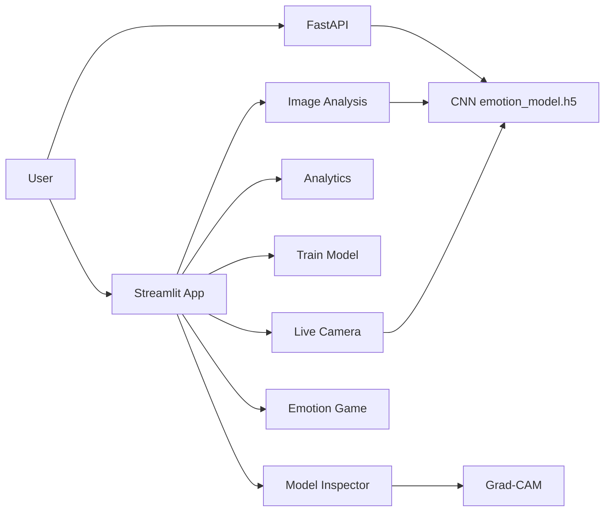

# PRD — EmotionLens: Real-Time Face Emotion Detection

| Field | Value |
| --- | --- |
| Version | v0.1 |
| Last Updated | 2026-08-06 |
| Owner | Product Manager |
| Status | In Review |

---

## 1. Executive Summary

EmotionLens is a real-time facial emotion recognition system that detects 7 emotions (Angry, Disgust, Fear, Happy, Neutral, Sad, Surprise) from images, video streams, and webcam feeds. A CNN trained on the FER2013 dataset (~62% validation accuracy, ~1.2M parameters) is served through three interfaces: a Streamlit web app (live camera, image analysis, analytics, model training UI, model inspector with Grad-CAM, and a gamified emotion challenge), a FastAPI REST API (`/health`, `/predict`, `/predict-file`), and a local webcam inference script.

## 2. Problem Statement

- **User pain:** Emotion detection demos are either non-interactive or require deep ML expertise to explore (training, feature maps, explanations).
- **Evidence/context:** FER2013 (35,887 grayscale 48×48 faces, 7 classes) is the standard benchmark; CNN ~62% accuracy is typical.
- **Cost of not solving it:** No accessible way to explore real-time emotion recognition, model internals, or retraining.

## 3. Goals & Non-Goals

| Goal | Metric | Target |
| --- | --- | --- |
| Real-time webcam detection | FPS | ≥ 15 FPS on CPU |
| 7-emotion classification | Validation accuracy | ~62% (FER2013 standard) |
| Explainability | Grad-CAM coverage | Every prediction |
| Interactive training UI | Training runs from UI | Configurable architectures |
| API inference | /predict latency | p95 < 1s |

### Non-Goals (v1)
- Multi-face tracking identities.
- Emotion recognition from audio/voice.
- Production-scale serving (single-user tool).
- Model quantization/edge deployment.

## 4. Target Users & Personas

| Persona | Role | Goals | Frustrations | Quote | Tech Comfort |
| --- | --- | --- | --- | --- | --- |
| Aisha — Data Science Student | Learns CV | Explore training + Grad-CAM | Opaque models | "Show me what the model sees." | Medium |
| Rahul — Hobbyist Dev | Builds demos | Live webcam emotions | Clunky pipelines | "I want it working in minutes." | Medium |
| Prof. Meera — Educator | Teaches ML | Interactive classroom demo | Static notebooks | "A live demo makes it click." | Low |

## 5. User Stories

| ID | As a... | I want... | So that... | Priority | Acceptance Criteria |
| --- | --- | --- | --- | --- | --- |
| US-001 | User | live webcam emotion detection | I see emotions in real time | P0 | Bounding boxes + labels + charts |
| US-002 | User | image upload analysis | I test any photo | P0 | Batch + radar charts |
| US-003 | User | analytics dashboard | I see trends | P1 | Distribution, trends, heatmaps |
| US-004 | Student | train models from UI | I experiment | P1 | Configurable arch + live progress |
| US-005 | Student | model inspector + Grad-CAM | I understand the model | P1 | Layer view + feature maps + heatmaps |
| US-006 | User | emotion challenge game | I engage | P2 | Two modes + badges |
| US-007 | Developer | REST API | I integrate programmatically | P1 | /predict + /predict-file + /health |

## 6. Feature List

| ID | Epic | Feature | Description | Priority | Status |
| --- | --- | --- | --- | --- | --- |
| REQ-001 | Live | Webcam detection | Real-time 7-emotion | P0 | Done |
| REQ-002 | Image | Upload analysis | Batch + radar charts | P0 | Done |
| REQ-003 | Analytics | Dashboard | Distribution/trends/heatmaps | P1 | Done |
| REQ-004 | Training | In-app training UI | Configurable arch + progress | P1 | Done |
| REQ-005 | Explain | Model inspector | Layers, feature maps, Grad-CAM | P1 | Done |
| REQ-006 | Game | Emotion challenge | 2 modes + badges | P2 | Done |
| REQ-007 | API | FastAPI inference | base64 + file upload | P1 | Done |

## 7. User Journeys (high level)

## 8. Success Metrics / KPIs

| Metric | Target | Measurement |
| --- | --- | --- |
| North Star: sessions with live detection | ≥ 80% of sessions | Streamlit analytics |
| Accuracy | ~62% | FER2013 validation |
| Inference latency | p95 < 1s | API logs |
| FPS | ≥ 15 | webcam benchmark |

## 9. Assumptions & Dependencies

- Trained model file `emotion_model.h5` present (train or download).
- Webcam available for live features.
- `packages.txt` system deps (libgl1-mesa-glx, libglib2.0-0) for Streamlit Cloud.

## 10. Risks

Top 3 (full list in ../project/RiskRegister.md):
1. **Model accuracy ceiling (~62%)** — inherent to FER2013; transparent.
2. **Webcam permissions/availability** — degraded gracefully.
3. **Large model file in repo/cloud** — documented upload requirement.

## 11. Release Criteria

- [ ] Live webcam detection works ≥ 15 FPS.
- [ ] Image upload + batch analysis works.
- [ ] FastAPI `/health`, `/predict`, `/predict-file` respond.
- [ ] Training UI completes a small run.
- [ ] Grad-CAM renders.
- [ ] Deployable to Streamlit Cloud.

## 12. Open Questions

| Question | Owner | Resolve by |
| --- | --- | --- |
| Quantize model for edge deployment? | Eng Lead | Release 1.1 |
| Multi-face identity tracking? | PM | Release 2.0 |

## 13. Related Documents

| Document | Relationship |
| --- | --- |
| [TechSpec.md](../technical/TechSpec.md) | Architecture, stack |
| [AppFlow.md](../design/AppFlow.md) | Screen flows |
| [Design.md](../design/Design.md) | Design system |
| [Schema.md](../technical/Schema.md) | Data model |
| [ImplementationPlan.md](../project/ImplementationPlan.md) | Build plan |
| [Tracker.md](../project/Tracker.md) | Task status |
| [Rules.md](../project/Rules.md) | Standards |
| [API.md](../technical/API.md) | API contracts |
| [SecurityAndCompliance.md](../technical/SecurityAndCompliance.md) | Data handling |
| [Testing.md](../technical/Testing.md) | Test strategy |
| [Deployment.md](../technical/Deployment.md) | Deployment |
| [Glossary.md](../reference/Glossary.md) | Vocabulary |
| [RiskRegister.md](../project/RiskRegister.md) | Risks |
