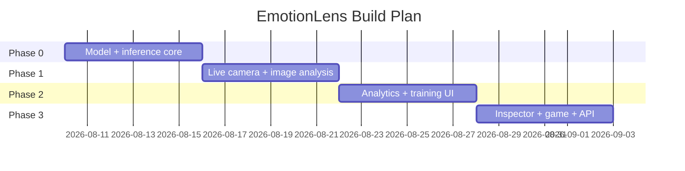
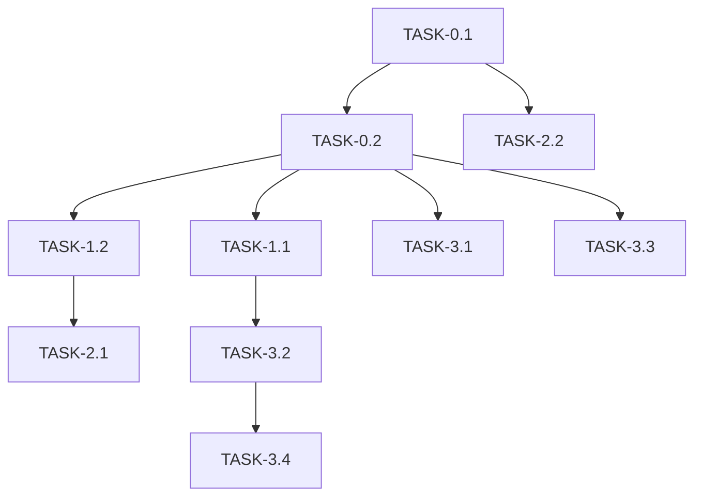

# ImplementationPlan — EmotionLens: Phased Build Plan

|Field|Value|
|---|---|
|Version|v0.1|
|Last Updated|2026-08-06|
|Owner|Engineering Lead|
|Status|In Review|

---

## 1. Build Philosophy

Model-first: get inference + live camera working, then layer analytics, training UI, explainability, and gamification. The API is added alongside so everything is programmatically accessible.

## 2. Phase Overview

## 3. Phase Breakdown

### Phase 0: Core
- Goal: model trained + inference engine.
- Exit: `python inference.py` predicts on sample.

|TASK-#|Description|Depends on|Owner|Est.|Maps to|
|---|---|---|---|---|---|
|TASK-0.1|Train CNN (FER2013)|—|ML|4d|REQ-004|
|TASK-0.2|Inference engine + utils|TASK-0.1|Eng|2d|REQ-001|

### Phase 1: Live + Image
- Goal: webcam + upload pages.
- Exit: live detection ≥ 15 FPS.

|TASK-#|Description|Depends on|Owner|Est.|Maps to|
|---|---|---|---|---|---|
|TASK-1.1|Live camera page|TASK-0.2|FE|3d|REQ-001|
|TASK-1.2|Image analysis + radar|TASK-0.2|FE|3d|REQ-002|

### Phase 2: Analytics + Training
- Goal: analytics + in-app training.
- Exit: training run completes in UI.

|TASK-#|Description|Depends on|Owner|Est.|Maps to|
|---|---|---|---|---|---|
|TASK-2.1|Analytics dashboard|TASK-1.2|FE|3d|REQ-003|
|TASK-2.2|Training UI + progress|TASK-0.1|FE|3d|REQ-004|

### Phase 3: Explain + Game + API
- Goal: inspector, game, REST API.
- Exit: all pages + endpoints work.

|TASK-#|Description|Depends on|Owner|Est.|Maps to|
|---|---|---|---|---|---|
|TASK-3.1|Model inspector + Grad-CAM|TASK-0.2|ML|3d|REQ-005|
|TASK-3.2|Emotion game|TASK-1.1|FE|2d|REQ-006|
|TASK-3.3|FastAPI /predict, /predict-file|TASK-0.2|Eng|2d|REQ-007|
|TASK-3.4|About page + polish|TASK-3.2|FE|1d|—|

## 4. Dependency Graph

## 5. Environment & Tooling Setup Checklist

- [ ] `pip install -r requirements.txt`
- [ ] Train or download `emotion_model.h5`
- [ ] Webcam available (live features)
- [ ] `streamlit run streamlit_app.py`
- [ ] `python api_server.py` (sidecar)

## 6. Rollout Strategy

- Single-app deploy; Streamlit Cloud primary.
- API as optional sidecar.
- Rollback: revert model file/commit.

## 7. Definition of Done (global)

- [ ] Tests pass
- [ ] Docs updated (this suite)
- [ ] Reviewed
- [ ] No secrets
- [ ] Manual smoke: live + upload + API

## 8. Related Documents

|Document|Relationship|
|---|---|
|[PRD.md](../product/PRD.md)|REQ mapping|
|[TechSpec.md](../technical/TechSpec.md)|Components|
|[AppFlow.md](../design/AppFlow.md)|Flows|
|[Schema.md](../technical/Schema.md)|Data|
|[Design.md](../design/Design.md)|UI tasks|
|[Tracker.md](Tracker.md)|Status|
|[Rules.md](Rules.md)|Standards|
|[API.md](../technical/API.md)|Contract|
|[SecurityAndCompliance.md](../technical/SecurityAndCompliance.md)|Privacy|
|[Testing.md](../technical/Testing.md)|Tests|
|[Deployment.md](../technical/Deployment.md)|Rollout|
|[Glossary.md](../reference/Glossary.md)|Vocabulary|
|[RiskRegister.md](RiskRegister.md)|Risks|
