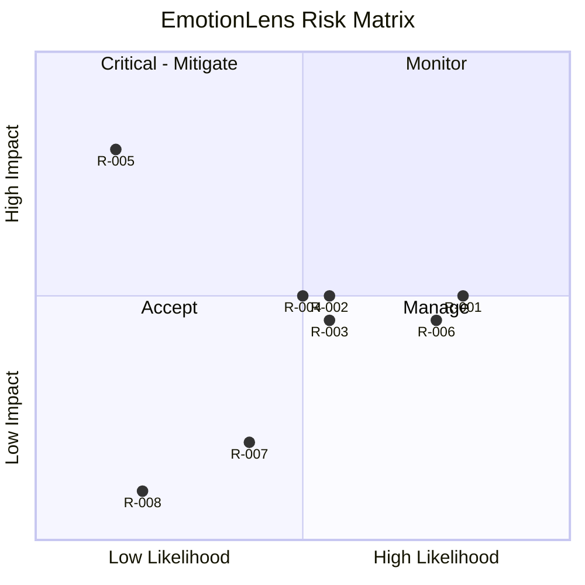

# RiskRegister — EmotionLens: Known Risks

|Field|Value|
|---|---|
|Version|v0.1|
|Last Updated|2026-08-06|
|Owner|PM / Eng Lead|
|Status|In Review|

---

|Risk|Likelihood|Impact|Score|Mitigation|Owner|Status|
|---|---|---|---|---|---|---|
|R-001 Accuracy ceiling ~62%|High|Medium|4|Transparent docs; FER2013 standard|ML|Accepted|
|R-002 Webcam unavailable/denied|Medium|Medium|4|Graceful degradation to image mode|FE|Mitigating|
|R-003 Model file size/large binary|Medium|Medium|4|External model path; upload docs|Eng|Mitigating|
|R-004 CPU inference slow|Medium|Medium|4|Lightweight CNN; model cache|Eng|Mitigating|
|R-005 Privacy of camera frames|Low|High|5|Frames never persisted (rule)|Security|Mitigating|
|R-006 No automated tests|High|Medium|4|Establish pytest suite (Testing.md)|QA|🔴 Open|
|R-007 Grad-CAM slow on large images|Medium|Low|2|Downscale/skip|ML|Accepted|
|R-008 Streamlit Cloud quota|Low|Low|1|Docker fallback|DevOps|Accepted|

## Risk Matrix

## Related Documents

|Document|Relationship|
|---|---|
|[PRD.md](../product/PRD.md)|Top-3 risks|
|[SecurityAndCompliance.md](../technical/SecurityAndCompliance.md)|R-005|
|[TechSpec.md](../technical/TechSpec.md)|R-004|
|[AppFlow.md](../design/AppFlow.md)|Flows|
|[Design.md](../design/Design.md)|Design|
|[Schema.md](../technical/Schema.md)|Data|
|[ImplementationPlan.md](ImplementationPlan.md)|Mitigations|
|[Tracker.md](Tracker.md)|R-006|
|[Rules.md](Rules.md)|Standards|
|[API.md](../technical/API.md)|Endpoints|
|[Testing.md](../technical/Testing.md)|R-006|
|[Deployment.md](../technical/Deployment.md)|Rollback|
|[Glossary.md](../reference/Glossary.md)|Vocabulary|
