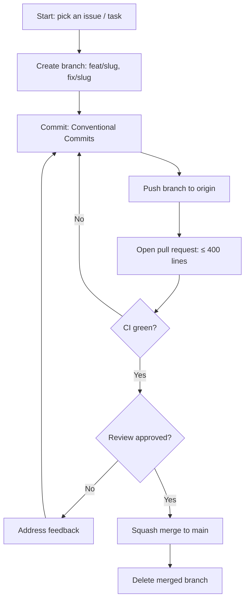

# Rules — EmotionLens: Coding Standards & AI-Agent Operating Rules

| Field | Value |
| --- | --- |
| Version | v0.1 |
| Last Updated | 2026-08-06 |
| Owner | Engineering Lead |
| Status | In Review |

---

## 1. Guiding Principles

1. Clarity over cleverness.
2. No silent failures — model loading errors are explicit.
3. Graceful degradation — no camera? image mode still works.
4. Small PRs only.
5. Tests accompany behavior changes.
6. Privacy-first — camera frames never persisted.

## 2. Code Style

- Python 3.8+, type hints.
- Formatter: black; linter: ruff.
- Structure:

```
streamlit_app.py          # entry + sidebar nav
api_server.py             # FastAPI
inference.py              # core engine
train.py                  # training script
webcam_inference.py       # CLI webcam
utils/
  model_utils.py          # load/cache model
  emotion_utils.py        # preprocess/predict/Grad-CAM
  session_utils.py        # session state
pages/
  page1_live_camera.py ... page7_about.py
assets/style.css
```

## 3. Git Workflow

- Branches: `feat/<slug>`, `fix/<slug>`.
- Commits: Conventional Commits.
- PRs: ≤ 400 lines, CI green.
- Merge: squash to main.

## 4. Testing Requirements

- Coverage ≥ 50% (UI-heavy project; core utils higher).
- MUST have tests: preprocessing, model load, API endpoints, Grad-CAM.
- See [Testing.md](../technical/Testing.md).

## 5. AI Agent Operating Rules

- Always read Tracker.md and ImplementationPlan.md before starting.
- Never mark a task 🟢 Done without tests passing.
- Never invent requirements not in ../product/PRD.md/../technical/TechSpec.md — flag ambiguity.
- Never commit secrets; env vars per ../technical/SecurityAndCompliance.md.
- Never persist camera frames.
- State conflicts rather than silently picking one.

## 6. Security Baseline Rules

- No secrets in repo.
- API input validation (Pydantic).
- Upload size caps.
- Dependency scans weekly.

## 7. Documentation Rules

- New endpoints → ../technical/API.md same PR.
- New pages → ../design/AppFlow.md same PR.

## 8. Prohibited Patterns

| Anti-pattern | Why |
| --- | --- |
| Persisting camera frames | Privacy |
| Committing large model binaries | Repo bloat |
| Blanket except | Hides failures |
| Hardcoded model path | Portability |

## 9. Escalation Rules

**Ask a human when:** model license use, biometric data policy, new datasets.
**Decide autonomously:** UI refactors, config, tests.

## Git / PR Workflow



## 10. Related Documents

| Document | Relationship |
| --- | --- |
| [Testing.md](../technical/Testing.md) | Test requirements |
| [SecurityAndCompliance.md](../technical/SecurityAndCompliance.md) | Privacy |
| [PRD.md](../product/PRD.md) | Requirements |
| [TechSpec.md](../technical/TechSpec.md) | Architecture |
| [AppFlow.md](../design/AppFlow.md) | Flows |
| [Design.md](../design/Design.md) | Design |
| [Schema.md](../technical/Schema.md) | Data |
| [ImplementationPlan.md](ImplementationPlan.md) | Tasks |
| [Tracker.md](Tracker.md) | Status |
| [API.md](../technical/API.md) | Contract |
| [Deployment.md](../technical/Deployment.md) | Env vars |
| [Glossary.md](../reference/Glossary.md) | Vocabulary |
| [RiskRegister.md](RiskRegister.md) | Risks |
