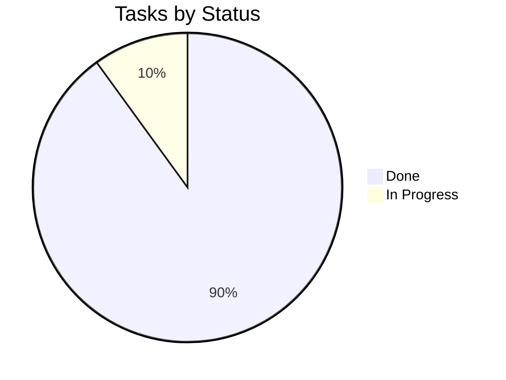

# Tracker — EmotionLens: Living Status Tracker

|Field|Value|
|---|---|
|Version|v0.1|
|Last Updated|2026-08-06|
|Owner|Engineering Lead|
|Status|In Review|

---

## 1. Snapshot Dashboard

|Metric|Value|
|---|---|
|Overall % Complete|80%|
|Current Phase|Phase 3|
|Tasks Done / Total|12 / 15|
|Blockers (open)|0|
|Days to Target Launch|10|

## 2. Status Legend

🟢 Done | 🟡 In Progress | 🔴 Blocked | ⚪ Not Started | 🔵 In Review

## 3. Phase Progress Bars

|Phase|Progress|
|---|---|
|Phase 0: Core|`[████████░░] 100%`|
|Phase 1: Live + Image|`[████████░░] 100%`|
|Phase 2: Analytics + Training|`[████████░░] 100%`|
|Phase 3: Explain + Game + API|`[█████░░░░░] 50%`|

## 4. Full Task Table

|TASK|Description|Status|Assignee|Start|Target|Actual|Notes|
|---|---|---|---|---|---|---|---|
|TASK-0.1|Train CNN|🟢|ML|2026-07-01|2026-07-06|—|62% acc|
|TASK-0.2|Inference engine|🟢|Eng|2026-07-07|2026-07-09|—||
|TASK-1.1|Live camera|🟢|FE|2026-07-10|2026-07-13|—||
|TASK-1.2|Image analysis|🟢|FE|2026-07-13|2026-07-16|—||
|TASK-2.1|Analytics|🟢|FE|2026-07-17|2026-07-20|—||
|TASK-2.2|Training UI|🟢|FE|2026-07-20|2026-07-24|—||
|TASK-3.1|Inspector + Grad-CAM|🟢|ML|2026-07-25|2026-07-29|—||
|TASK-3.2|Emotion game|🟡|FE|2026-07-30|—|—|in progress|
|TASK-3.3|FastAPI endpoints|🟢|Eng|2026-07-30|2026-08-02|—||
|TASK-3.4|About + polish|⚪|FE|—|—|—||

## 5. Blockers Log

|ID|Description|Raised|Owner|Impact|Status|
|---|---|---|---|---|---|
|BLK-001|None open|—|—|—|—|

## 6. Changelog

|Date|What shipped|
|---|---|
|2026-08-06|Docs suite v0.1|
|2026-08-02|FastAPI endpoints shipped|

## 7. Burndown Summary

## 8. Next 3 Priorities

1. Finish TASK-3.2 — Emotion game.
2. TASK-3.4 — About page + polish.
3. Final smoke test + deploy.

## 9. Related Documents

|Document|Relationship|
|---|---|
|[ImplementationPlan.md](ImplementationPlan.md)|Tasks|
|[PRD.md](../product/PRD.md)|Features|
|[TechSpec.md](../technical/TechSpec.md)|Components|
|[AppFlow.md](../design/AppFlow.md)|Flows|
|[Design.md](../design/Design.md)|Design|
|[Schema.md](../technical/Schema.md)|Data|
|[Rules.md](Rules.md)|Standards|
|[API.md](../technical/API.md)|Contract|
|[SecurityAndCompliance.md](../technical/SecurityAndCompliance.md)|Privacy|
|[Testing.md](../technical/Testing.md)|Tests|
|[Deployment.md](../technical/Deployment.md)|Deploy|
|[Glossary.md](../reference/Glossary.md)|Vocabulary|
|[RiskRegister.md](RiskRegister.md)|Risks|
