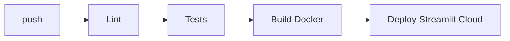

# Deployment — EmotionLens: Environments, CI/CD, Rollback

| Field | Value |
| --- | --- |
| Version | v0.1 |
| Last Updated | 2026-08-06 |
| Owner | DevOps Engineer |
| Status | In Review |

---

## 1. Service Topology

| Service | Purpose | Port |
| --- | --- | --- |
| streamlit | UI | 8501 |
| api | FastAPI (sidecar) | 8000 |

## 2. CI/CD Pipeline

## 3. Environment Promotion

| Step | From | To | Trigger |
| --- | --- | --- | --- |
| 1 | main | cloud | CI green (Streamlit Cloud auto) |

## 4. Rollback Procedure

- Streamlit Cloud: revert to previous commit.
- Docker: revert image tag.

## 5. Feature Flags

- N/A — environment-driven model path (`MODEL_PATH`).

## 6. On-Call / Runbook

- **App not loading:** model file missing → upload/train.
- **Camera fails:** browser permissions.
- **API down:** sidecar not running → restart.

## 7. Related Documents

| Document | Relationship |
| --- | --- |
| [TechSpec.md](TechSpec.md) | Environments |
| [SecurityAndCompliance.md](SecurityAndCompliance.md) | Hosting policy |
| [PRD.md](../product/PRD.md) | Release criteria |
| [AppFlow.md](../design/AppFlow.md) | Flows |
| [Schema.md](Schema.md) | Data |
| [Design.md](../design/Design.md) | Design |
| [ImplementationPlan.md](../project/ImplementationPlan.md) | Rollout |
| [Tracker.md](../project/Tracker.md) | Status |
| [Rules.md](../project/Rules.md) | Standards |
| [API.md](API.md) | Endpoints |
| [Testing.md](Testing.md) | CI gates |
| [Glossary.md](../reference/Glossary.md) | Vocabulary |
| [RiskRegister.md](../project/RiskRegister.md) | Risks |
