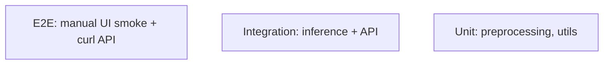

# Testing — EmotionLens: Test Strategy

| Field | Value |
| --- | --- |
| Version | v0.1 |
| Last Updated | 2026-08-06 |
| Owner | QA Engineer |
| Status | In Review |

---

## 1. Test Pyramid

## 2. Strategy

| Layer | Tool | Scope |
| --- | --- | --- |
| Unit | pytest | Preprocessing, emotion utils, model load |
| Integration | pytest + TestClient | /predict, /predict-file, /health |
| E2E | Manual scripts | Live camera, upload, Grad-CAM smoke |

> Note: repo currently has no test suite (NO_TESTS_FOUND) — this plan establishes one.

## 3. Critical Test Cases

| ID | Feature | Case | Expected |
| --- | --- | --- | --- |
| TC-001 | Preprocessing | 48×48 grayscale conversion | Valid tensor |
| TC-002 | Model load | Missing .h5 | Clear error |
| TC-003 | Predict | Valid base64 | 7-class JSON |
| TC-004 | Predict-file | Valid file upload | Same shape |
| TC-005 | Predict | Bad base64 | 400/422 |
| TC-006 | Grad-CAM | Sample image | Heatmap produced |
| TC-007 | Live | No webcam | Graceful message |

## 4. Test Data Strategy

- Sample face images; FER2013 subset for tests.

## 5. CI Gates

- `pytest` green (once established).
- Ruff lint.
- Coverage ≥ 50%.

## 6. Related Documents

| Document | Relationship |
| --- | --- |
| [Rules.md](../project/Rules.md) | Test requirements |
| [PRD.md](../product/PRD.md) | Release criteria |
| [TechSpec.md](TechSpec.md) | Components |
| [AppFlow.md](../design/AppFlow.md) | Flow tests |
| [Schema.md](Schema.md) | Data tests |
| [API.md](API.md) | Contract tests |
| [Design.md](../design/Design.md) | UI tests |
| [ImplementationPlan.md](../project/ImplementationPlan.md) | Test tasks |
| [Tracker.md](../project/Tracker.md) | Status |
| [SecurityAndCompliance.md](SecurityAndCompliance.md) | Privacy tests |
| [Deployment.md](Deployment.md) | Test env |
| [Glossary.md](../reference/Glossary.md) | Vocabulary |
| [RiskRegister.md](../project/RiskRegister.md) | Risks |
